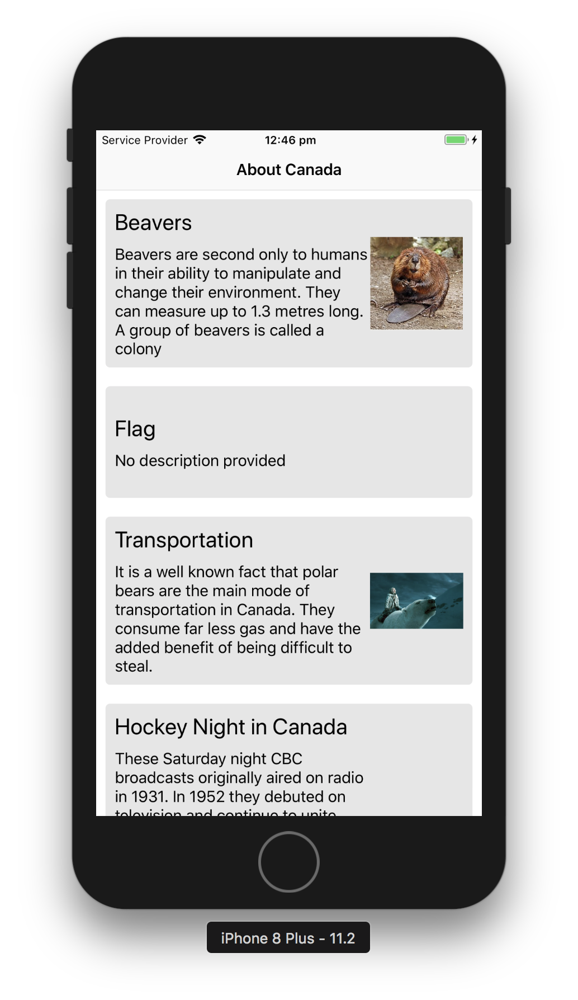
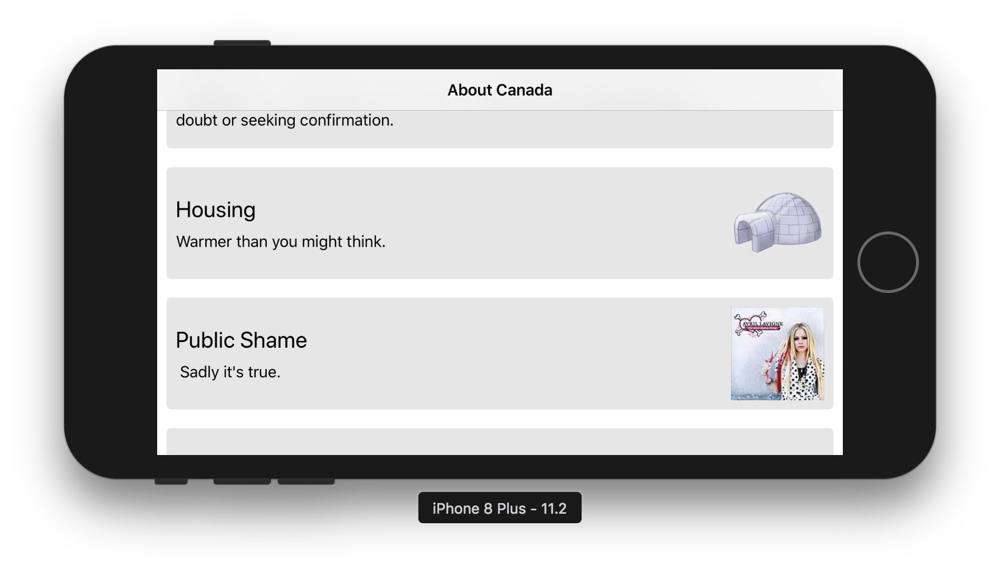
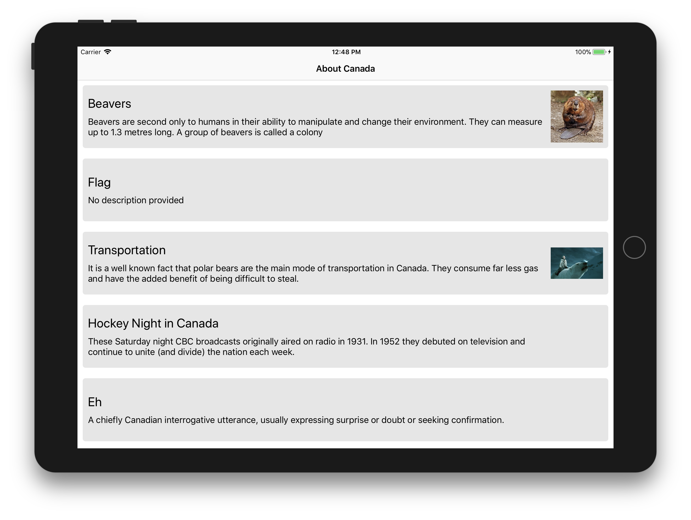

# Canada Facts Demo
_______________________________

### Features:
* Swift 4, iOS 9
* Uses `Codable` protocol to do json parsing
* `Snapkit` to do programatic layout(no xib ro storyboards)
* `Kingfisher` to fetch remote image
* lazy download images
* pull to refresh
* Supports both iPhone and iPad both orientations
* No circular reference or memory leaks

### Screenshots:
iPhone portrait:

iPhone landscape

iPad

